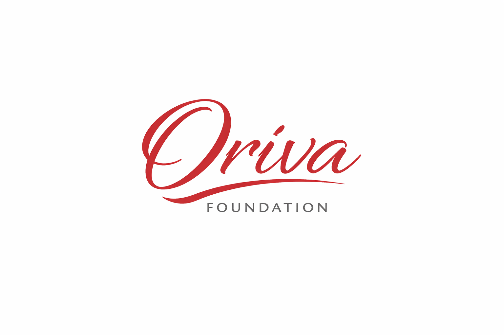

<div align="center">
  
</div>

# Oriva Foundation

A modern, professional portfolio website for Oriva Foundation - a non-profit organization focused on building Islamic applications and community-driven projects that deliver impactful digital solutions for society.

## Live Demo

[Visit Oriva Foundation](https://oriva-nine.vercel.app/)

## 📋 Overview

Oriva Foundation is dedicated to:
- Building Islamic applications
- Creating community-driven projects
- Delivering impactful digital solutions for society

This website showcases our mission, projects, impact, team, and provides ways for community members to get involved and support our work.

## Quick Start

### Prerequisites
- Node.js 18.0 or higher
- npm or yarn

### Installation

```bash
# Clone the repository
git clone https://github.com/Oriva-Foundation/oriva.git
cd oriva

# Install dependencies
npm install

# Start development server
npm run dev
```

The website will be available at [http://localhost:3000](http://localhost:3000)

## 📦 Build for Production

```bash
# Create optimized production build
npm run build

# Start production server
npm start
```

## 📁 Project Structure

```
oriva/
├── app/
│   ├── page.tsx                    # Home page
│   ├── about/page.tsx              # About page
│   ├── projects/page.tsx           # Projects showcase
│   ├── impact/page.tsx             # Impact metrics & stories
│   ├── team/page.tsx               # Team members
│   ├── support/page.tsx            # Sponsorship & support
│   ├── join/page.tsx               # Join us recruitment
│   ├── contact/page.tsx            # Contact form
│   ├── privacy/page.tsx            # Privacy policy
│   ├── terms/page.tsx              # Terms of service
│   ├── layout.tsx                  # Root layout
│   └── globals.css                 # Global styles
├── components/
│   ├── Button.tsx                  # Reusable button
│   ├── Navbar.tsx                  # Navigation bar
│   ├── Footer.tsx                  # Footer
│   ├── HeroSection.tsx             # Hero banner
│   ├── ProjectCard.tsx             # Project display
│   ├── TeamCard.tsx                # Team member card
│   ├── SectionWrapper.tsx          # Section container
│   └── SponsorCard.tsx             # Sponsor CTA
├── public/
│   ├── imgs/
│   │   └── oriva.png               # Logo
│   └── favicon.ico
├── package.json                    # Dependencies
├── tsconfig.json                   # TypeScript config
├── tailwind.config.ts              # Tailwind config
├── README.md                       # This file
├── CONTRIBUTING.md                 # Contribution guidelines
├── CODE_OF_CONDUCT.md              # Community guidelines
└── LICENSE                         # MIT License
```

## Design System

### Color Palette
- **Primary**: Red (#C62828)
- **Secondary**: White (#FFFFFF)
- **Text**: Dark Gray (#171717)
- **Background**: White (#FFFFFF)
- **Borders**: Light Gray (#E0E0E0)

### Typography
- **Font Family**: System fonts (Geist Sans, Segoe UI, etc.)
- **Heading Size**: 2xl to 7xl
- **Body Size**: Base to lg

## 📄 Pages

| Page | URL | Description |
|------|-----|-------------|
| Home | `/` | Landing page with featured projects and impact stats |
| About | `/about` | Our mission, vision, and values |
| Projects | `/projects` | Showcase and filtering of all projects |
| Impact | `/impact` | Impact metrics and success stories |
| Team | `/team` | Meet our team members |
| Support | `/support` | Sponsorship tiers and support options |
| Join Us | `/join` | Information about joining Oriva |
| Contact | `/contact` | Contact form and methods |
| Privacy | `/privacy` | Privacy policy |
| Terms | `/terms` | Terms of service |

## Technologies Used

| Technology | Version | Purpose |
|-----------|---------|---------|
| Next.js | 16.2.3 | React framework with App Router |
| React | 19.2.4 | UI library |
| TypeScript | ^5 | Type safety |
| Tailwind CSS | ^4 | Utility-first CSS |
| Framer Motion | ^11.0.0 | Animations |

## Features

- ✅ **Fully Responsive**: Mobile, tablet, and desktop support
- ✅ **Light Mode**: Clean, bright aesthetic
- ✅ **Smooth Animations**: Framer Motion throughout
- ✅ **SEO Optimized**: Meta tags, Open Graph support
- ✅ **TypeScript**: Full type safety
- ✅ **Performance**: Optimized builds, code splitting
- ✅ **Accessible**: Semantic HTML, ARIA labels
- ✅ **Open Source**: GitHub integration

## 📝 Scripts

```bash
npm run dev      # Start development server
npm run build    # Build for production
npm start        # Start production server
npm run lint     # Run ESLint
```

## Contributing

We welcome contributions! Please see [CONTRIBUTING.md](./CONTRIBUTING.md) for guidelines.

## 💬 Code of Conduct

We are committed to providing a welcoming and inclusive environment. Please see [CODE_OF_CONDUCT.md](./CODE_OF_CONDUCT.md).

## 📞 Contact

- **Email**: orivafoundation@gmail.com
- **GitHub**: [@Oriva-Foundation](https://github.com/Oriva-Foundation)
- **Sponsor**: [GitHub Sponsors](https://github.com/sponsors/soghayarmahmoud)

## 🙏 Acknowledgments

Special thanks to all contributors and community members who support our mission.

## 📜 License

This project is licensed under the MIT License - see [LICENSE](./LICENSE) file for details.

## 🌟 Support

Your support helps us build better digital solutions for communities:
- ⭐ Star this repository
- 💰 [Sponsor us on GitHub](https://github.com/sponsors/soghayarmahmoud)
- 👥 Contribute code or ideas
- 📣 Share our work

---

**Made with ❤️ for community impact**

Built by the Oriva Foundation Team
